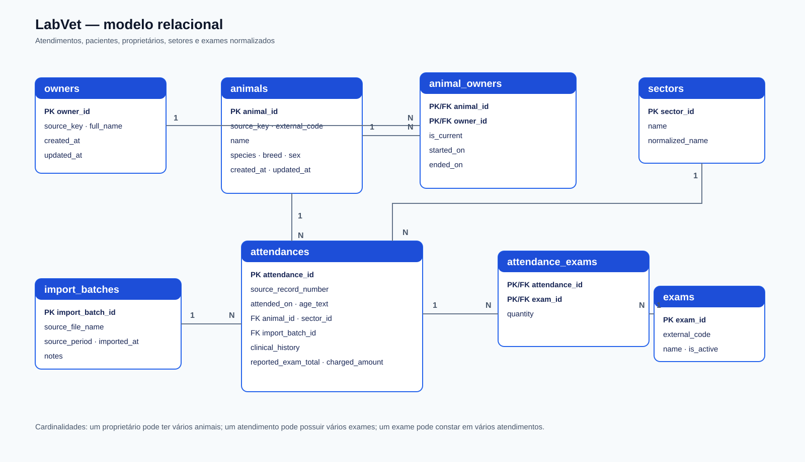

# Modelo de dados — LabVet

## Objetivo

Armazenar os atendimentos laboratoriais veterinários com rastreabilidade para a planilha de origem. Cada linha válida da planilha corresponde a um atendimento, identificado por `Registro`.

> **Status do modelo atual:** este documento descreve o esquema legado atualmente
> carregado. A proposta para alinhar a nomenclatura dos campos ao padrão Itriax
> está em [001_labvet_schema_itriax.sql](../database/proposed/001_labvet_schema_itriax.sql).
> Ela é apenas uma proposta de revisão e ainda não foi aplicada.

## Diagrama



## Tabelas

| Tabela | Finalidade | Chave principal |
| --- | --- | --- |
| `owners` | Cadastro de proprietários. `source_key` evita juntar grafias diferentes durante a carga inicial. | `owner_id` |
| `animals` | Cadastro de pacientes. `external_code` preserva o campo `Código` da origem; `source_key` liga a carga inicial de forma segura. | `animal_id` |
| `animal_owners` | Histórico de vínculo entre animal e proprietário. Permite troca de proprietário sem apagar o histórico. | `animal_id`, `owner_id` |
| `sectors` | Setores normalizados, por exemplo, clínica ou oncologia. | `sector_id` |
| `exams` | Catálogo de exames; cada código externo é único. O nome pode ser preenchido quando o catálogo for disponibilizado. | `exam_id` |
| `import_batches` | Identifica o arquivo e a execução de importação. | `import_batch_id` |
| `attendances` | Atendimento registrado na planilha, identificado pela origem `HV` ou `AMA` e pelo registro de origem. | `attendance_id` |
| `attendance_exams` | Associação entre atendimentos e exames. | `attendance_id`, `exam_id` |
| `lab_report_types` | Catálogo de tipos de laudo, incluindo Bioquímica, Hemograma, Urinálise, Imuno 4DX, Cortisol, T4, Técnica de Knott, Leptospirose, compatibilidade sanguínea, hemoaglutinação, pesquisa de hemoparasitas e análises de líquidos. | `lab_report_type_id` |
| `laboratory_reports` | Laudo Excel ou PDF vinculado ao atendimento, identificado também pela origem `HV` ou `AMA`, com metadados e texto extraído. | `laboratory_report_id` |
| `lab_report_exams` | Vínculo entre laudos e exames solicitados. | `laboratory_report_id`, `exam_id` |
| `lab_analytes` | Catálogo de analitos e marcadores laboratoriais. | `lab_analyte_id` |
| `laboratory_results` | Resultado por analito, com referência, unidade e seção do laudo. | `laboratory_result_id` |
| `laboratory_report_notes` | Observações, achados e fontes presentes no laudo. | `laboratory_report_note_id` |

## Regras de importação

- `Origem` identifica a planilha `HV` ou `AMA`. Com `Registro`, compõe a chave
  de negócio única de `attendances`; o mesmo número pode existir nas duas origens.
- `Registro` alimenta `attendances.source_record_number`.
- Cada laudo usa a mesma origem do atendimento. Arquivos com prefixo `A` são associados ao `AMA`; os demais, ao `HV`.
- Todos os formatos mapeados preservam texto integral e comentários. Resultados quantitativos são gravados em campos próprios com unidade e referências quando fornecidas; resultados qualitativos são gravados em `result_text` por parâmetro.
- `Data` alimenta `attendances.attended_on`.
- `Código`, `Animal`, `Espécie`, `Raça` e `Sexo` alimentam `animals`; `Idade` permanece no atendimento porque é uma observação daquela data.
- `Proprietário` cria ou relaciona um registro em `owners`, via `animal_owners`.
- `Setor` é normalizado antes de inserir em `sectors`. A planilha preservada continua sendo a fonte de auditoria.
- `Histórico`, `Total de exames` e `Valor` são preservados em `attendances` sem recalcular seu significado.
- Na planilha, o conteúdo de `Exames` é recebido separado por vírgula. Antes da carga, os códigos são ordenados numericamente e gravados no CSV de estágio separados por ` | `; por exemplo, `16,17,18,21,1,32` torna-se `1 | 16 | 17 | 18 | 21 | 32`. Cada item cria ou encontra um registro em `exams` e gera uma linha em `attendance_exams`.
- Um mesmo exame repetido no mesmo atendimento deve ser gravado uma única vez em `attendance_exams`, somando as repetições na coluna `quantity`.

## Decisões de qualidade de dados

- `external_code` não possui restrição de unicidade, porque a planilha atual contém códigos associados a mais de um nome ou proprietário. A unicidade só deve ser aplicada após revisão dos cadastros. As chaves técnicas `source_key` preservam o vínculo correto da carga inicial.
- Linhas sem dados clínicos além de registro e data não devem criar pacientes nem atendimentos clínicos; devem entrar no relatório de rejeições da rotina de importação.
- Valores ausentes permanecem `NULL`, nunca zero.
- Grafias de setor, espécie e sexo devem ser normalizadas por uma tabela de mapeamento na rotina de importação, sem substituir a planilha original.

## Execução local

Na pasta raiz do projeto, execute:

```powershell
docker compose up -d
```

O banco fica disponível em `localhost:5434`, com nome e usuário definidos no arquivo `.env`. O esquema é `labvet`.

Para verificar a inicialização:

```powershell
docker compose exec postgres psql -U labvet_app -d labvet -c "\\dt labvet.*"
```

## Escopo atual

Em 07/10/2026, os dados do LabVet foram migrados da instância Itriax para o
contêiner dedicado `labvet-postgres`, publicado na porta local `5434`. A base
`labvet` foi removida do PostgreSQL do Itriax após a validação da migração.

A instância dedicada contém 14 tabelas, 695 atendimentos, 1.008 laudos e
15.568 resultados laboratoriais. Um backup pré-migração é mantido localmente
em `database/backups/` e é ignorado pelo Git por conter dados clínicos reais.

A carga inicial de setembro de 2026 está descrita em
[importacao-setembro-2026.md](importacao-setembro-2026.md).
